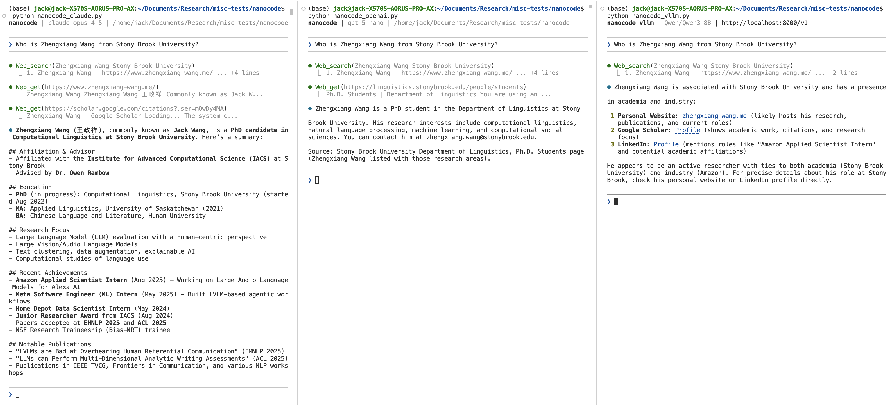

# nanocode

Minimal Claude Code alternatives, adapted from [this repo](https://github.com/1rgs/nanocode), which contains single Python file, zero dependencies, ~250 lines. The adapted version introduces 

Besides claude models the original codebase supports, the adaption adds supports to GPT models from OpenAI and open-weight models supported by [vllm](https://github.com/vllm-project/vllm/tree/main) hosted via OpenAI Chat Completions API. Below are demonstrations of the three types of models that come with this repo. 



## Features

- Full agentic loop with tool use
- Tools: `read`, `write`, `edit`, `glob`, `grep`, `bash`, `web_search`, and `web_get` (the web search tools are additionally introduced and they are **free** to use by leveraging duckduckgo search enginee)
- Conversation history
  - Additionally supports saving conversational history

- Colored terminal output
  - If you want a better markdown support in the terminal output, run `pip install rich`


## Usage

You can specify the model and system prompt (via text or text filepath) to use via command lines for the following three scripts.

#### Claude Models

```bash
export ANTHROPIC_API_KEY=your-key
python nanocode_claude.py
```

#### GPT Models

```bash
export OPENAI_API_KEY=your-key
python nanocode_openai.py
```

#### Open-weight models via vLLM

In one terminal, run something like the following

```bash
vllm serve Qwen/Qwen3-8B --host 0.0.0.0 --port 8000 --max-model-len 30000 --gpu-memory-utilization 0.95 --enable-auto-tool-choice --tool-call-parser hermes --reasoning-parser qwen3 --structured-outputs-config.backend xgrammar
```

Run, in **another** terminal, do

```bash
python nanocode_vllm.py
```


## Commands

- `/c` - Clear conversation
- `/q` or `exit` - Quit


## Tools

| Tool | Description |
|------|-------------|
| `read` | Read file with line numbers, offset/limit |
| `write` | Write content to file |
| `edit` | Replace string in file (must be unique) |
| `glob` | Find files by pattern, sorted by mtime |
| `grep` | Search files for regex |
| `bash` | Run shell command |
| `web_search` | Perform web search using duckduckgo |
| `web_get` | Fetch a webpage and return plain text |


## Example

See the screenshot in the beginning.


## License

MIT
